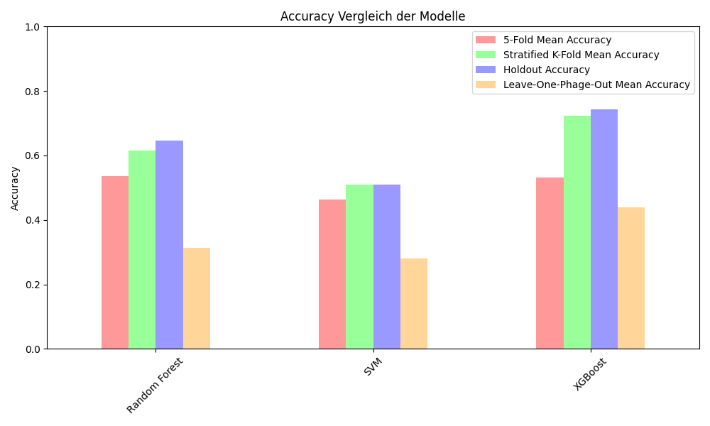
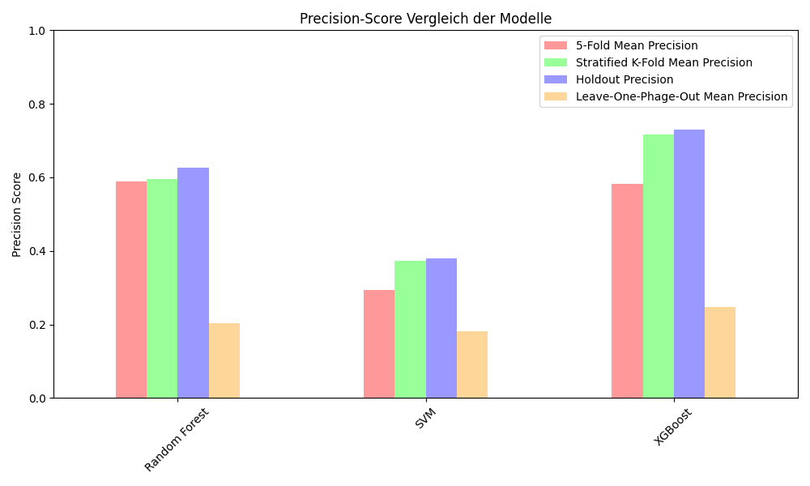
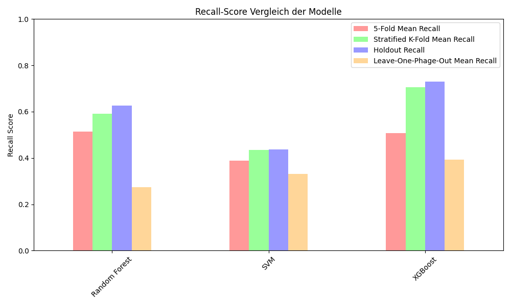

Verwendete Metriken:

Accuracy:
-> Gesamtleistung: grober Überlick, wie oft das Modell richtig lag
- gibt einen allgemeinen Überblick über die Modellleistung
- einfach zu interpretieren
- kann jedoch bei unausgeglichenen Klassen irreführend sein, daher nicht als einzige Metrik verwendet sondern als Ergänzung

F1 Score:
-> balanciert die beiden Metriken Precision und Recall, wichtigste unserer Metriken
- gibt eine zusammenfassende Bewertung, die sowohl falsch Positive als auch falsch Negative berücksichtigt
- besonders sinnvoll bei unausgeglichenen Klassen

Precision:
-> Korekktheit positiver Vorhersagen
- wieviele positiven Vorhersagen sind tatsächlich positiv?
- Fehlerquellen pro Klasse besser analysierbar

Recall:
-> Vollständigkeit positiver Vorhersagen
- Wieviele der tatsächlich Positiven wurden erkannt?
- Fehlerquellen pro Klasse besser analysierbar

bei F1-Score, Precision und Recall wurde der macro-Average berechnet:
- die Metrik wird für jede Klasse seperat berechnet und dann über alle Klassen gemittelt
-> alle Klassen gleich gewichtet, auch wenn manche seltener sind

Ergebnisse der verschiedenen Metriken in Bezug auf unterschiedliche Modelle:

